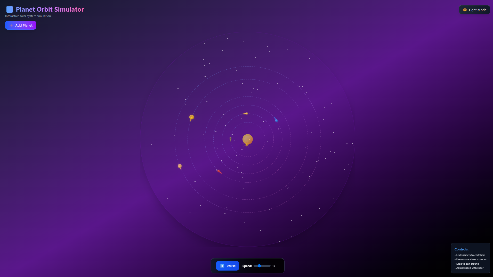

# 🌌 Planet Orbit Simulator

An interactive, real-time solar system simulation built with React that allows you to create, customize, and observe planetary orbits around a central star.




## ✨ Features

- **Interactive Planet Creation**: Add custom planets with configurable properties
- **Real-time Orbital Mechanics**: Watch planets orbit with realistic physics
- **Customizable Properties**: Adjust size, color, orbit radius, and orbital speed
- **Zoom & Pan Controls**: Navigate the solar system with mouse controls
- **Speed Control**: Adjust simulation speed from 0.1x to 3x
- **Visual Trails**: See planetary paths with glowing particle trails
- **3D-style Planets**: Realistic planet rendering with shadows and highlights
- **Animated Sun**: Central star with pulsing glow and rotating rays
- **Dark/Light Theme**: Toggle between viewing modes
- **Interactive Tooltips**: Hover over planets to see detailed information

## 🚀 Quick Start

### Prerequisites

- Node.js (version 14 or higher)
- npm  package manager

### Installation

1. **Clone or download the project files**
   ```bash
   # If using git
   git clone <repository-url>
   cd planet-orbit-simulator
   
   # Or create a new React project
   npx create-react-app planet-orbit-simulator
   cd planet-orbit-simulator
   ```

2. **Install dependencies**
   ```bash
     npm install
   ```


3. **Start the development server**
   ```bash
   npm start
   # or
   yarn start
   ```


## 🎮 Usage Guide

### Basic Controls

#### Navigation
- **Mouse Wheel**: Zoom in/out (0.3x to 4x zoom)
- **Click & Drag**: Pan around the solar system


#### Playback Controls
- **Play/Pause Button**: Start/stop the orbital animation
- **Speed Slider**: Adjust simulation speed (0.1x to 3x normal speed)
- **Theme Toggle**: Switch between dark and light modes

### Planet Management

#### Adding New Planets
1. Click the **"➕ Add Planet"** button in the top-left
2. Fill in the planet details:
   - **Name**: Give your planet a unique name
   - **Color**: Choose the planet's color using the color picker
   - **Size**: Set the planet diameter (recommended: 6-30 pixels)
   - **Orbit Radius**: Distance from the sun (recommended: 80-400 pixels)
   - **Orbital Speed**: How fast the planet orbits (recommended: 0.001-0.02)
3. Click **"Add Planet"** to create it

#### Editing Existing Planets
1. **Click on any planet** in the simulation
2. The Planet Control panel will open on the left
3. Modify any property:
   - Adjust color, size, orbit radius, or speed
   - Changes apply in real-time
4. Click **"Remove Planet"** to delete the selected planet

## 🧩 Technical Details

### Built With
- **React 18+**: Modern React with hooks
- **Tailwind CSS**: Utility-first styling
- **react-zoom-pan-pinch**: Zoom and pan functionality
- **HTML5 Canvas**: High-performance rendering
- **CSS Animations**: Smooth visual effects

### Architecture
```
src/
├── App.js              # Main application component
├── components/
│   ├── OrbitCanvas.js  # Main simulation canvas
│   ├── Planet.js       # Individual planet component
│   ├── Star.js         # Central sun component
│   ├── Controls.js     # Playback controls
│   └── PlanetManager.js # Planet creation/editing
├── index.css           # Global styles
└── index.js            # App entry point
```

### Physics Model
- **Circular orbits**: Simplified Kepler orbits
- **Constant angular velocity**: Uniform circular motion
- **No gravitational interactions**: Planets don't affect each other
- **Scalable time**: Adjustable simulation speed

#

### How to Contribute
1. Fork the repository
2. Create a feature branch (`git checkout -b feature/amazing-feature`)
3. Commit your changes (`git commit -m 'Add amazing feature'`)
4. Push to the branch (`git push origin feature/amazing-feature`)
5. Open a Pull Request
